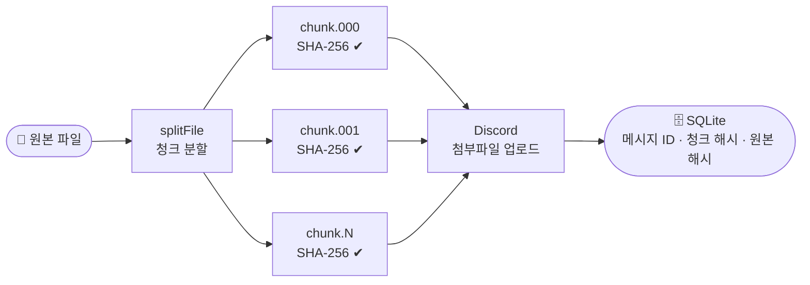
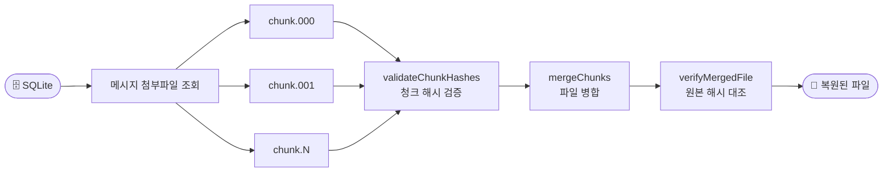

# DriveCord

Discord를 무료 파일 저장소로 사용합니다. DriveCord는 대용량 파일을 청크로 분할해 Discord 메시지 첨부파일로 업로드하고, 다운로드 시 병합하여 복원합니다. 모든 과정에서 SHA-256 무결성 검증을 수행합니다.

로컬 웹 UI를 통해 파일 업로드·다운로드·삭제를 브라우저에서 직접 관리할 수 있으며, 파일 매니페스트는 SQLite 데이터베이스로 영속 관리됩니다.

## 동작 원리

### 업로드



### 다운로드



각 청크는 SHA-256 해시와 함께 SQLite DB에 기록됩니다. 다운로드 시 모든 청크를 병합 전에 재검증하고, 최종 파일을 원본 해시와 대조합니다.

## 요구 사항

- Node.js 18 이상
- Discord 봇 토큰 ([Discord Developer Portal](https://discord.com/developers/applications))
- 봇에게 **메시지 보내기**, **메시지 관리** 및 **파일 첨부** 권한이 있는 Discord 텍스트 채널

## 설정

```bash
# 1. 의존성 설치
npm install

# 2. .env 파일 생성
cp .env.example .env
```

`.env` 파일 편집:

```env
DISCORD_TOKEN=봇_토큰_입력
DISCORD_CHANNEL_ID=채널_ID_입력
```

채널 ID 복사 방법: Discord 설정에서 **개발자 모드**를 활성화한 뒤, 채널 우클릭 → **ID 복사**.

## 사용법

### 웹 UI (권장)

```bash
npm run dev
```

서버가 시작되면 브라우저가 자동으로 열립니다 (`http://localhost:3000`).

- **업로드** — 파일을 드래그하거나 클릭하여 선택, 실시간 진행률 표시
- **다운로드** — 목록에서 파일 선택 후 클릭, 청크 다운로드 진행률 표시
- **삭제** — 로컬 DB 기록만 삭제하거나, Discord 청크 메시지까지 함께 삭제 선택 가능

### CLI

```bash
# 파일 업로드
npm run cli -- upload <파일경로> [매니페스트_저장경로]

# 파일 다운로드
npm run cli -- download <매니페스트_경로> [출력_디렉토리]
```

```bash
# 예시
npm run cli -- upload ./video.mp4
npm run cli -- download ./video.mp4.manifest.json ./output
```

> **참고**: CLI 모드는 매니페스트를 JSON 파일로 출력합니다. 웹 UI 모드에서 업로드한 파일과는 별개로 동작합니다.

### 빌드 후 실행

```bash
npm run build
node dist/main.js        # 웹 UI 서버
node dist/index.js upload ./video.mp4   # CLI
```

## 환경 변수

`.env` 파일에서 모든 옵션을 설정할 수 있습니다:

| 변수                 | 기본값           | 설명                          |
| -------------------- | ---------------- | ----------------------------- |
| `DISCORD_TOKEN`      | -                | **(필수)** 봇 토큰            |
| `DISCORD_CHANNEL_ID` | -                | **(필수)** 대상 채널 ID       |
| `CHUNK_SIZE`         | `5242880` (5 MB) | 청크 하나의 최대 크기 (bytes) |
| `UPLOAD_RETRIES`     | `3`              | 업로드 실패 시 재시도 횟수    |
| `RETRY_DELAY_MS`     | `2000`           | 재시도 간격 (ms)              |
| `PORT`               | `3000`           | 웹 UI 서버 포트               |

**서버 부스트 레벨별 권장 청크 크기:**

| 부스트 레벨 | 권장 `CHUNK_SIZE`    |
| ----------- | -------------------- |
| 무료        | `5242880` (5 MB)     |
| Level 2     | `52428800` (50 MB)   |
| Level 3     | `104857600` (100 MB) |

## 프로젝트 구조

```
src/
├── main.ts              NestJS 부트스트랩 · 브라우저 자동 실행
├── app.module.ts        루트 모듈
├── config.ts            .env 로더
├── types.ts             공통 TypeScript 인터페이스
├── chunker.ts           파일 → Buffer 청크 분할 (SHA-256 포함)
├── merger.ts            Buffer 청크 → 파일 병합 (검증 포함)
├── uploader.ts          Discord 청크 업로드
├── downloader.ts        Discord 청크 다운로드
├── store.ts             CLI용 JSON 매니페스트 관리
├── index.ts             CLI 진입점 및 TUI 렌더링
├── ui.ts                프로그래스바 및 스타일 로그 헬퍼
├── discord/
│   ├── discord.module.ts
│   └── discord.service.ts   부트스트랩 시 Discord 연결 유지 (OnModuleInit)
├── database/
│   ├── database.module.ts   TypeORM + SQLite 설정
│   └── file-manifest.entity.ts   file_manifests 테이블 엔티티
└── files/
    ├── files.module.ts
    ├── files.controller.ts  REST API 엔드포인트
    └── files.service.ts     업로드 · 다운로드 · 삭제 비즈니스 로직

public/
├── index.html           웹 UI
├── style.css            다크 테마 스타일
└── app.js               업로드 · 다운로드 · 삭제 · SSE 처리

data/
└── drivecord.db         SQLite 데이터베이스 (자동 생성)
```

## REST API

| 메서드   | 경로                          | 설명                                         |
| -------- | ----------------------------- | -------------------------------------------- |
| `GET`    | `/api/files`                  | 파일 목록 조회                               |
| `POST`   | `/api/files/upload`           | 파일 업로드 (multipart), SSE 진행률 스트리밍 |
| `POST`   | `/api/files/:id/download`     | 다운로드 시작, SSE 진행률 스트리밍           |
| `GET`    | `/api/files/job/:jobId`       | 완성된 파일 다운로드 (10분 후 만료)          |
| `DELETE` | `/api/files/:id`              | 로컬 DB 기록만 삭제                          |
| `DELETE` | `/api/files/:id?discord=true` | 로컬 DB + Discord 청크 메시지 삭제           |

## 개발

```bash
npm run lint          # ESLint 검사
npm run lint:fix      # ESLint 자동 수정
npm run format        # Prettier 포맷 적용
npm run format:check  # Prettier 포맷 검사만
```

## 라이선스

MIT
