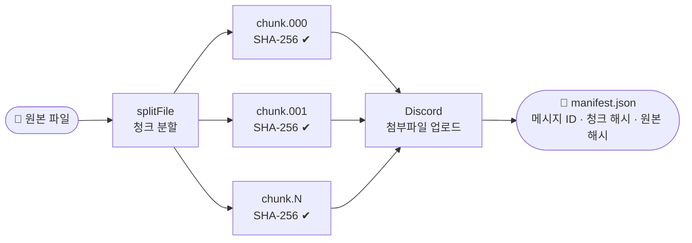
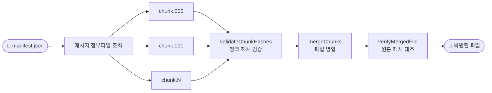

# DriveCord

Discord를 무료 파일 저장소로 사용합니다. DriveCord는 대용량 파일을 청크로 분할해 Discord 메시지 첨부파일로 업로드하고, 다운로드 시 병합하여 복원합니다. 모든 과정에서 SHA-256 무결성 검증을 수행합니다.

---

## 동작 원리

### 업로드



### 다운로드



각 청크는 SHA-256 해시와 함께 매니페스트 JSON 파일에 기록됩니다. 다운로드 시 모든 청크를 병합 전에 재검증하고, 최종 파일을 원본 해시와 대조합니다.

---

## 요구 사항

- Node.js 18 이상
- Discord 봇 토큰 ([Discord Developer Portal](https://discord.com/developers/applications))
- 봇에게 **메시지 보내기** 및 **파일 첨부** 권한이 있는 Discord 텍스트 채널

---

## 설정

```bash
# 1. 의존성 설치
npm install

# 2. .env 파일 생성
cp .env.example .env
```

`.env` 파일 편집:

```env
DISCORD_TOKEN=봇_토큰_입력
DISCORD_CHANNEL_ID=채널_ID_입력
```

채널 ID 복사 방법: Discord 설정에서 **개발자 모드**를 활성화한 뒤, 채널 우클릭 → **ID 복사**.

---

## 사용법

### 업로드

```bash
ts-node src/index.ts upload <파일경로> [매니페스트_저장경로]
```

```bash
# 파일 업로드 (매니페스트는 파일 옆에 자동 저장)
ts-node src/index.ts upload ./video.mp4

# 매니페스트 저장 경로를 직접 지정
ts-node src/index.ts upload ./video.mp4 ./manifests/video.json
```

메시지 ID, 청크 해시, 원본 파일 해시가 담긴 `.manifest.json` 파일이 생성됩니다. **이 파일은 다운로드에 반드시 필요하므로 보관하세요.**

### 다운로드

```bash
ts-node src/index.ts download <매니페스트_경로> [출력_디렉토리]
```

```bash
# 현재 디렉토리에 복원
ts-node src/index.ts download ./video.mp4.manifest.json

# 특정 디렉토리에 복원
ts-node src/index.ts download ./video.mp4.manifest.json ./output
```

### 빌드 후 실행

```bash
npm run build
node dist/index.js upload ./video.mp4
node dist/index.js download ./video.mp4.manifest.json
```

---

## 환경 변수

`.env` 파일에서 모든 옵션을 설정할 수 있습니다:

| 변수                 | 기본값           | 설명                          |
| -------------------- | ---------------- | ----------------------------- |
| `DISCORD_TOKEN`      | -                | **(필수)** 봇 토큰            |
| `DISCORD_CHANNEL_ID` | -                | **(필수)** 대상 채널 ID       |
| `CHUNK_SIZE`         | `5242880` (5 MB) | 청크 하나의 최대 크기 (bytes) |
| `UPLOAD_RETRIES`     | `3`              | 업로드 실패 시 재시도 횟수    |
| `RETRY_DELAY_MS`     | `2000`           | 재시도 간격 (ms)              |

**서버 부스트 레벨별 권장 청크 크기:**

| 부스트 레벨 | 권장 `CHUNK_SIZE`    |
| ----------- | -------------------- |
| 무료        | `5242880` (5 MB)     |
| Level 2     | `52428800` (50 MB)   |
| Level 3     | `104857600` (100 MB) |

---

## 프로젝트 구조

```
src/
├── index.ts       CLI 진입점 및 TUI 렌더링
├── ui.ts          프로그래스바 및 스타일 로그 헬퍼
├── config.ts      .env 로더
├── types.ts       공통 TypeScript 인터페이스
├── chunker.ts     파일 → Buffer 청크 분할 (SHA-256 포함)
├── merger.ts      Buffer 청크 → 파일 병합 (검증 포함)
├── uploader.ts    Discord 청크 업로드
└── downloader.ts  Discord 청크 다운로드
```

---

## 개발

```bash
npm run lint          # ESLint 검사
npm run lint:fix      # ESLint 자동 수정
npm run format        # Prettier 포맷 적용
npm run format:check  # Prettier 포맷 검사만
```

---

## 라이선스

MIT
