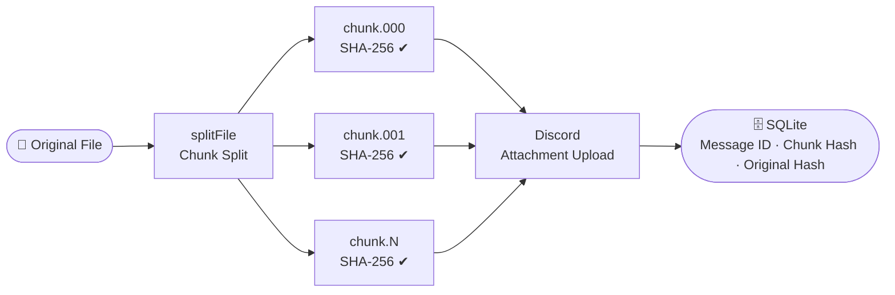
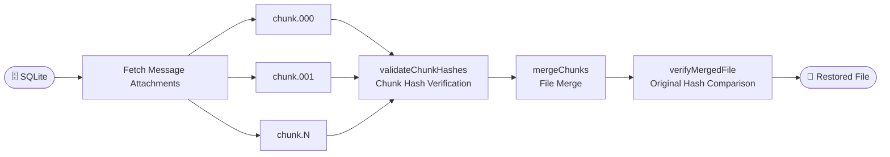

# DriveCord


https://github.com/user-attachments/assets/edff9b94-afcc-43a1-828c-940430d27e19

Use Discord as a free file storage. DriveCord splits large files into chunks, uploads them as Discord message attachments, and reassembles them on download. SHA-256 integrity verification is performed throughout the entire process.

A local web UI lets you manage file uploads, downloads, and deletions directly from your browser. File manifests are persisted in a SQLite database.

## How It Works

### Upload



### Download



Each chunk is recorded in the SQLite DB along with its SHA-256 hash. On download, all chunks are re-verified before merging, and the final file is compared against the original hash.

## Requirements

- Node.js 18 or higher
- Discord bot token ([Discord Developer Portal](https://discord.com/developers/applications))
- A Discord text channel where the bot has **Send Messages**, **Manage Messages**, and **Attach Files** permissions

## Setup

```bash
# 1. Install dependencies
npm install

# 2. Create .env file
cp .env.example .env
```

Edit the `.env` file:

```env
DISCORD_TOKEN=your_bot_token
DISCORD_CHANNEL_ID=your_channel_id
```

To copy a channel ID: enable **Developer Mode** in Discord settings, then right-click the channel → **Copy ID**.

## Usage

### Web UI (Recommended)

```bash
npm run dev
```

Once the server starts, a browser window will open automatically (`http://localhost:3000`).

- **Upload** — Drag and drop or click to select a file; real-time progress display
- **Download** — Select a file from the list and click; chunk download progress display
- **Delete** — Choose to delete only the local DB record, or also delete the Discord chunk messages

### CLI

```bash
# Upload a file
npm run cli -- upload <file-path> [manifest-save-path]

# Download a file
npm run cli -- download <manifest-path> [output-directory]
```

```bash
# Examples
npm run cli -- upload ./video.mp4
npm run cli -- download ./video.mp4.manifest.json ./output
```

> **Note**: CLI mode outputs manifests as JSON files. It operates independently from files uploaded via the Web UI.

### Run After Build

```bash
npm run build
node dist/main.js        # Web UI server
node dist/index.js upload ./video.mp4   # CLI
```

## Environment Variables

All options can be configured in the `.env` file:

| Variable             | Default          | Description                         |
| -------------------- | ---------------- | ----------------------------------- |
| `DISCORD_TOKEN`      | -                | **(Required)** Bot token            |
| `DISCORD_CHANNEL_ID` | -                | **(Required)** Target channel ID    |
| `CHUNK_SIZE`         | `5242880` (5 MB) | Maximum size of one chunk (bytes)   |
| `UPLOAD_RETRIES`     | `3`              | Number of retries on upload failure |
| `RETRY_DELAY_MS`     | `2000`           | Delay between retries (ms)          |
| `PORT`               | `3000`           | Web UI server port                  |

**Recommended chunk sizes by server boost level:**

| Boost Level | Recommended `CHUNK_SIZE` |
| ----------- | ------------------------ |
| Free        | `5242880` (5 MB)         |
| Level 2     | `52428800` (50 MB)       |
| Level 3     | `104857600` (100 MB)     |

## Project Structure

```
src/
├── main.ts              NestJS bootstrap · auto-open browser
├── app.module.ts        Root module
├── config.ts            .env loader
├── types.ts             Shared TypeScript interfaces
├── chunker.ts           File → Buffer chunk split (with SHA-256)
├── merger.ts            Buffer chunks → file merge (with verification)
├── uploader.ts          Discord chunk upload
├── downloader.ts        Discord chunk download
├── store.ts             CLI JSON manifest management
├── index.ts             CLI entry point and TUI rendering
├── ui.ts                Progress bar and styled log helpers
├── discord/
│   ├── discord.module.ts
│   └── discord.service.ts   Keep Discord connection alive (OnModuleInit)
├── database/
│   ├── database.module.ts   TypeORM + SQLite configuration
│   └── file-manifest.entity.ts   file_manifests table entity
└── files/
    ├── files.module.ts
    ├── files.controller.ts  REST API endpoints
    └── files.service.ts     Upload · download · delete business logic

public/
├── index.html           Web UI
├── style.css            Dark theme styles
└── app.js               Upload · download · delete · SSE handling

data/
└── drivecord.db         SQLite database (auto-created)
```

## REST API

| Method   | Path                          | Description                                        |
| -------- | ----------------------------- | -------------------------------------------------- |
| `GET`    | `/api/files`                  | List files                                         |
| `POST`   | `/api/files/upload`           | Upload file (multipart), SSE progress streaming    |
| `POST`   | `/api/files/:id/download`     | Start download, SSE progress streaming             |
| `GET`    | `/api/files/job/:jobId`       | Download completed file (expires after 10 minutes) |
| `DELETE` | `/api/files/:id`              | Delete local DB record only                        |
| `DELETE` | `/api/files/:id?discord=true` | Delete local DB record + Discord chunk messages    |

## Development

```bash
npm run lint          # ESLint check
npm run lint:fix      # ESLint auto-fix
npm run format        # Apply Prettier formatting
npm run format:check  # Check Prettier formatting only
```

## License

MIT
